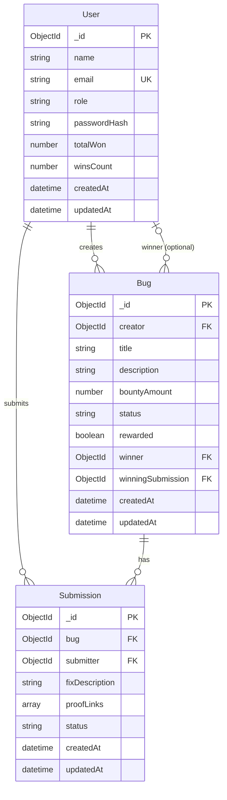

# Database Schema & ER Diagram

## ER Diagram (Mermaid)

## Collections (MongoDB)

### users

| Field       | Type     | Required | Notes                      |
|------------|----------|----------|----------------------------|
| name       | String   | Yes      | 2-100 chars                |
| email      | String   | Yes      | Unique, lowercase          |
| role       | String   | Yes      | `user` \| `admin`          |
| passwordHash | String | Yes      | bcrypt hash                |
| totalWon   | Number   | No       | Default 0                  |
| winsCount  | Number   | No       | Default 0                  |
| createdAt  | Date     | Auto     |                            |
| updatedAt  | Date     | Auto     |                            |

### bugs

| Field             | Type     | Required | Notes                          |
|-------------------|----------|----------|--------------------------------|
| creator           | ObjectId | Yes      | ref: User                      |
| title             | String   | Yes      | 3-200 chars                    |
| description       | String   | Yes      | min 10 chars                   |
| bountyAmount      | Number   | Yes      | min 0                          |
| status            | String   | Yes      | OPEN \| IN_REVIEW \| CLOSED    |
| rewarded          | Boolean  | No       | Default false                  |
| winner            | ObjectId | No       | ref: User, set on approval     |
| winningSubmission | ObjectId | No       | ref: Submission                |
| createdAt         | Date     | Auto     |                                |
| updatedAt         | Date     | Auto     |                                |

### submissions

| Field          | Type     | Required | Notes                    |
|----------------|----------|----------|--------------------------|
| bug            | ObjectId | Yes      | ref: Bug                 |
| submitter      | ObjectId | Yes      | ref: User                |
| fixDescription | String   | Yes      | min 10 chars             |
| proofLinks     | [String] | No       | Array of URLs            |
| status         | String   | Yes      | PENDING \| APPROVED \| REJECTED |
| createdAt      | Date     | Auto     |                          |
| updatedAt      | Date     | Auto     |                          |

**Index:** `{ bug: 1, submitter: 1 }` — limits duplicate submissions per user per bug.
